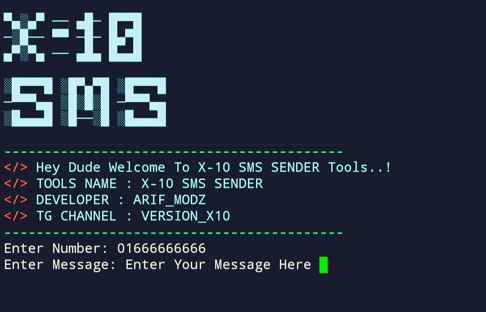

# X-10-SMS-SENDER V1.0

# Tested On
- Termux

# Installation Command

```console
 apt-get update -y
```
```console
apt-get upgrade -y
```
```console
 pkg install python -y
```
```console
 pip install requests
```

```console
 pkg install git -y
```
```console
 git clone https://github.com/Versionx10/X-10-SMS-SENDER.git
```
```console
 cd X-10-SMS-SENDER
```
```console
 python X-10-SMS.py
```

# ULTRA EMAIL BOMBER 


# Warning
***This tool is only for educational purpose. We are not responsible for any misuse or illegal activities.***
